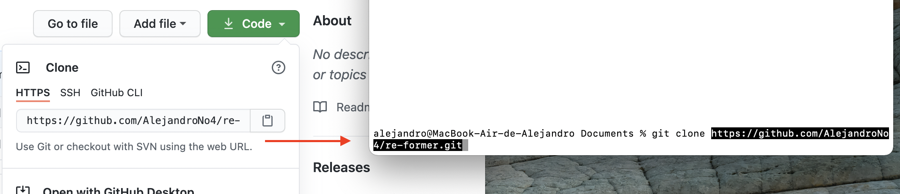
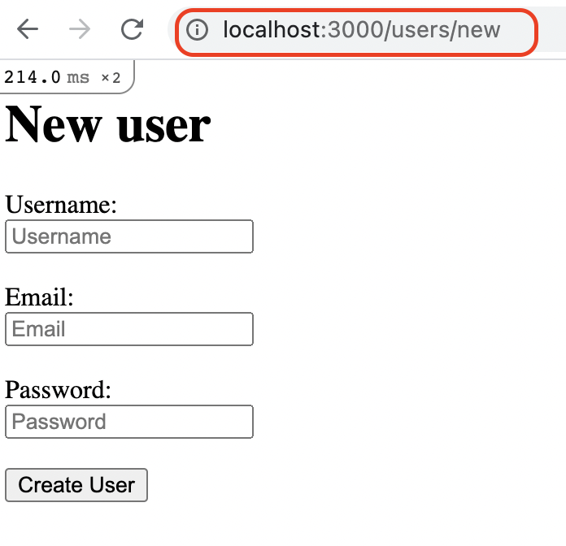
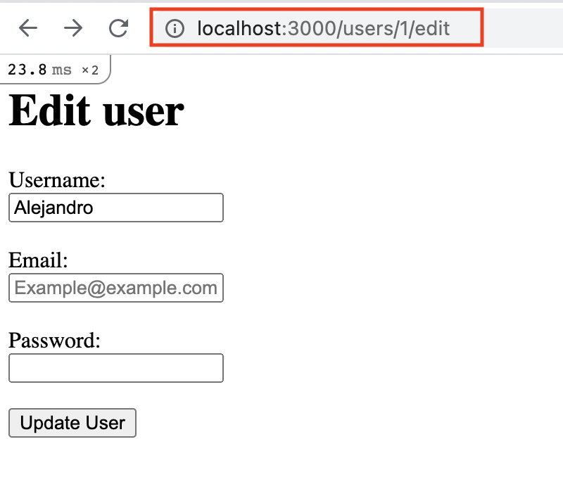

# Basic Forms Rails

> This project is part of the Microverse Rails curriculum.

This project was made for learning proposes, to practice the way of creating forms with Rails. It was for practice and understand the way data is structured and sent to the controller.

## Getting Started

**Keep in mind that it is preferable to run this program with the most up-to-date version of Ruby.**

Even though this is just for practice, feel free to clone this repo and play around with it. You can practice with this too.

### Prerequisites

- Basic knowledge of the terminal of your computer
- Basic knowledge of git
- Ruby 2.6.0 or later version
- Github account
- Rails pre-installed
- Basic knowledge of active record

**If you don't have plenty of knowledge of one of these, here are some helpful links that can explain to you how to get and/or use them.**

**Terminal**
[- Basic guide](https://www.techrepublic.com/article/16-terminal-commands-every-user-should-know/)
 

**Git**
[- Basic guide](https://product.hubspot.com/blog/git-and-github-tutorial-for-beginners)
 

**Ruby**
[- Installation](https://www.ruby-lang.org/en/documentation/installation)
[- Quickstart](https://www.ruby-lang.org/en/documentation/quickstart/)
 

**Github**
[- Basic guide](https://guides.github.com/activities/hello-world/)
 

**Rails**
[- A playlist of videos that shows you how to install and use it](https://www.youtube.com/watch?v=iF8caVyDi5g&list=PLCC34OHNcOtrk3BDsfZwf4GattdLoKCOF)
 

**Active Record**
[- Basic guide](https://guides.rubyonrails.org/active_record_basics.html)
 
 

### Setup and usage

 

> 1. Clone this repo into your computer

- Click on "Code" and copy the HTTPS url
- Go to your terminal, and type: 

      $ git clone (paste the url direction)
 

 

- Now, change the folder direction, type: 

      $ cd re-former

> 2. Add a user from the browser

- In the terminal, type: 

      $ rails server

- Open the browser and go to the url http://localhost:3000/users/new
- Now you should be able to see the users creator form.
 

 

- Create a new user and submit.

> 3. Edit a user

- On the browser, open the url http://localhost:3000/users/1/edit (The number "1" could be any existing user id)
- Now you can edit that user's data
- Try to leave blank any of the fields to test the errors
 

 

> 4. Try adding more users and play around with them.

 
 

## Built With

- Ruby 3.0.0
- Rails 6.1.3
- VsCode
- Github
- Git
   

## Author

👤 **Alejandro Guadalupe Contreras Rodriguez**

- GitHub: [@AlejandroNo4](https://github.com/AlejandroNo4)
- Twitter: [@Alejand80002666](https://twitter.com/alejand80002666)
- LinkedIn: [Alejandro Contreras Rodriguez](https://www.linkedin.com/in/alejandro-contreras-rodriguez-b524821b5/)

## 🤝 Contributing

Contributions, issues, and feature requests are welcome!

Feel free to check the [issues page](https://github.com/AlejandroNo4/re-former/issues).

## Show your support

Give a ⭐️ if you like this project!

## Acknowledgments

Information based on:

[- The Odin Project](https://www.theodinproject.com/courses/ruby-on-rails/)

For a better understanding, I followed this tutorial from GoRails.

[- Rails for Beginners | GoRails](https://www.youtube.com/watch?v=wkNR1hG4yOk)